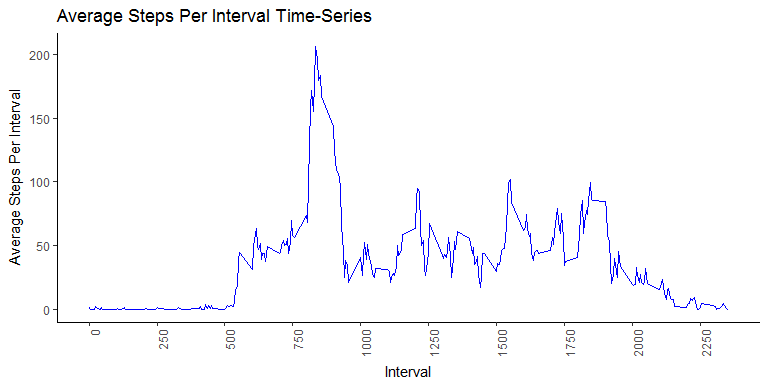

    library(knitr)
    knitr::opts_chunk$set(fig.width=8, fig.height=4, fig.path='figures/RepDataAssignment1_', echo=TRUE, warning=FALSE, message=FALSE)

### Introduction

It is now possible to collect a large amount of data about personal
movement using activity monitoring devices such as a Fitbit, Nike
Fuelband, or Jawbone Up. These type of devices are part of the
“quantified self” movement – a group of enthusiasts who take
measurements about themselves regularly to improve their health, to find
patterns in their behavior, or because they are tech geeks. But these
data remain under-utilized both because the raw data are hard to obtain
and there is a lack of statistical methods and software for processing
and interpreting the data.

### Data

This analysis makes use of data from a personal activity monitoring
device. This device collects data at 5 minute intervals through out the
day. The data consists of two months of data from an anonymous
individual collected during the months of October and November, 2012 and
include the number of steps taken in 5 minute intervals each day. The
source of the data is found
[here](https://d396qusza40orc.cloudfront.net/repdata%2Fdata%2Factivity.zip).

### Analysis

The analysis will cover:

-   Data loading and preparation steps
-   The distribution of the total number of steps taken each day
-   The mean and median number of steps taken each day
-   A time series plot of the average number of steps taken
-   The 5-minute interval that, on average, contains the maximum number
    of steps
-   Code to describe and show a strategy for imputing missing data
-   A distribution of the total number of steps taken each day after
    missing values are imputed
-   A Panel plot comparing the average number of steps taken per
    5-minute interval across weekdays and weekends

### Prepare Workspace and Load Libraries

    #Clear variables
    rm ( list = ls ( all = TRUE ) )
    #Get and set working directory
    setwd ( getwd () )
    install.packages("dplyr", repos = "http://cran.us.r-project.org")

    ## package 'dplyr' successfully unpacked and MD5 sums checked
    ## 
    ## The downloaded binary packages are in
    ##  C:\Users\DK\AppData\Local\Temp\Rtmpek8fji\downloaded_packages

    install.packages("ggplot2", repos = "http://cran.us.r-project.org")

    ## package 'ggplot2' successfully unpacked and MD5 sums checked
    ## 
    ## The downloaded binary packages are in
    ##  C:\Users\DK\AppData\Local\Temp\Rtmpek8fji\downloaded_packages

    install.packages("scales", repos = "http://cran.us.r-project.org")

    ## package 'scales' successfully unpacked and MD5 sums checked
    ## 
    ## The downloaded binary packages are in
    ##  C:\Users\DK\AppData\Local\Temp\Rtmpek8fji\downloaded_packages

    install.packages("lubridate", repos = "http://cran.us.r-project.org")

    ## package 'lubridate' successfully unpacked and MD5 sums checked
    ## 
    ## The downloaded binary packages are in
    ##  C:\Users\DK\AppData\Local\Temp\Rtmpek8fji\downloaded_packages

    suppressWarnings ( suppressMessages ( library ( dplyr) ) )
    suppressWarnings ( suppressMessages ( library ( ggplot2) ) )
    suppressWarnings ( suppressMessages ( library ( scales) ) )
    suppressWarnings ( suppressMessages ( library ( lubridate) ) )

### Load the Data

    #Download, unzip, load, and prepare the data set
    temp <- tempfile ()
    download.file ( "https://d396qusza40orc.cloudfront.net/repdata%2Fdata%2Factivity.zip", temp )
    unzip ( temp )
    unlink ( temp )
    Activity <- as.data.frame ( read.csv ( file = "activity.csv", header = TRUE, sep = "," ) )
    #Convert factor date to actual date
    Activity <- Activity %>% 
                mutate ( date = as.Date (date, format = "%Y-%m-%d") )

### Plot a histogram to visualize the total number of steps taken each day

#### Subset the Activity Data into Total Steps Per Day

    StepsPerDay <- Activity %>%
                   group_by(date) %>%
                   summarise ( steps = sum ( steps ) )

#### Intialize a Histogram to Create Frequency Labels

    #Initialize histogram
    ActivityHist <- hist ( StepsPerDay$steps ) 

    #Create frequency label variable
    ActivityHist$density = ( ActivityHist$counts / sum ( ActivityHist$counts ) ) * 100

    #Create vector for frequency labels
    BarLabels <- paste ( round ( ActivityHist$density ), "%", sep = "" )

#### Plot Formatted Histogram

    #Create the histogram
    plot ( ActivityHist, 
          freq = FALSE,
          main = "Steps Per Day Distribution", 
          xlab = "Steps", 
          ylab = "Percent of Total",
          col  = "blue",
          ylim = c( 0, 100 ),
          labels = BarLabels )

### Calculate the Mean and Median Steps Taken Each Day

    MeanStepsPerDay <-  mean ( StepsPerDay$steps, na.rm = TRUE )
    MedianStepsPerDay <- median ( StepsPerDay$steps, na.rm = TRUE )

Mean Steps Per Day: 10766.1886792453

Median Steps Per Day: 10765

### Plot a Time-Series of Average Steps Per Interval

#### Subset the Activity Data Into Average Steps Per Interval

    StepsPerInterval <- Activity %>%
                        group_by(interval) %>%
                        summarise ( steps = mean ( steps, na.rm = TRUE ) )

#### Plot the Time Series

    ggplot(data = StepsPerInterval, aes(x=interval, y=steps, group=1)) +
      geom_line ( colour = "blue" ) +
        labs(x = "Interval", y = "Average Steps Per Interval") +
        ggtitle( "Average Steps Per Interval Time-Series" ) + 
       scale_x_continuous( breaks = seq ( min ( StepsPerInterval$interval ), max ( StepsPerInterval$interval ), by = 250 ) ) +
      theme(axis.text.x=element_text(angle=90, hjust=1), panel.grid.major =     element_blank(),   panel.grid.minor = element_blank(), panel.background = element_blank(), axis.line = element_line(colour = "black"))

### Determine the Interval with the Maximum Number of Steps

    MaxStepsInterval <- StepsPerInterval %>% 
                        top_n ( n=1 ) %>% 
                        select ( interval )

On average across all the days in the dataset, the 835 interval contains
the maximum number of steps.

#### Determine the total number of missing values in the dataset

    TotalActivityNA <- sum (is.na ( Activity ) )

The total number of missing values in the dataset is 2304.

### Plot a Histogram with the Imputed Dataset

#### Impute Missing Values in the Dataset and Create a New Data Set with Imputed Values

To impute missing values, we will apply the respective weekly means to
all NA values for the week in which they occur

    #The imputing strategy is to apply the weekly means to all NA values
    ActivityFilled <- Activity %>%
                      mutate ( WeekBeginDate = paste ( year ( date ), week (date ) ) )   %>%
                      group_by ( WeekBeginDate ) %>%
                      mutate ( StepsFilled = ifelse ( is.nan ( mean ( steps, na.rm = TRUE  ) ), 0, mean ( steps, na.rm = TRUE  ) ) )                    %>%
                      ungroup() %>%
                      mutate ( steps = ifelse ( is.na ( steps ), StepsFilled, steps ) )

#### Subset the Activity Data into Total Steps Per Day

    StepsPerDay2 <- ActivityFilled %>%
                   group_by(date) %>%
                   summarise ( steps = sum ( steps ) )

#### Intialize a Histogram to Create Frequency Labels

    #Initialize histogram
    ActivityHist2 <- hist ( StepsPerDay2$steps ) 

    #Create frequency label variable
    ActivityHist2$density = ( ActivityHist2$counts / sum ( ActivityHist2$counts ) ) * 100

    #Create vector for frequency labels
    BarLabels2 <- paste ( round ( ActivityHist2$density ), "%", sep = "" )

#### Plot Formatted Histogram

    #Create the histogram
    plot.new()
    plot ( ActivityHist2, 
          freq = FALSE,
          main = "Steps Per Day Distribution", 
          xlab = "Steps", 
          ylab = "Percent of Total",
          col  = "blue",
          ylim = c( 0, 100 ),
          labels = BarLabels2 )

### Calculate the Mean and Median Steps Taken Each Day from the Imputed Data Set

    MeanStepsPerDay2 <-  mean ( StepsPerDay2$steps, na.rm = TRUE )
    MedianStepsPerDay2 <- median ( StepsPerDay2$steps, na.rm = TRUE )

Mean Steps Per Day: 10642.7581967213

Median Steps Per Day: 10571

As we can see, imputing values does effect measures of center,
especially the mean. The mean from the imputed data is less as the
imputing strategy used introduced values that effectively lowered the
mean.

### Plot a Time-Series of Average Steps Per Interval for Weekdays and Weekends

#### Subset the Activity Data Into Average Steps Per Interval for Weekdays and Weekends

    StepsPerIntervalWday <- Activity %>%
                            mutate ( IsWeekDay = ifelse ( wday(date) == c(1,7), "Weekend", "Weekday") ) %>%
                            group_by ( IsWeekDay, interval ) %>%
                            summarise ( steps = mean ( steps, na.rm = TRUE ) )

#### Plot the Time Series

    ggplot(data = StepsPerIntervalWday, aes(x=interval, y=steps, group=1)) +
      geom_line ( colour = "blue" ) +
      facet_grid ( IsWeekDay ~ . ) +
        labs(x = "Interval", y = "Average Steps Per Interval") +
        ggtitle( "Average Steps Per Interval Time-Series" ) + 
       scale_x_continuous( breaks = seq ( min ( StepsPerIntervalWday$interval ), max ( StepsPerIntervalWday$interval ), by = 250 ) ) +
      theme(axis.text.x=element_text(angle=90, hjust=1), panel.grid.major =     element_blank(),   panel.grid.minor = element_blank(), panel.background = element_blank(), axis.line = element_line(colour = "black")) +
    theme(panel.spacing = unit(2, "lines"))

